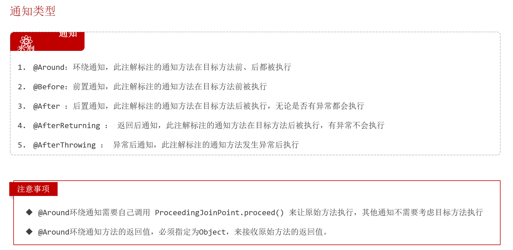

```angular2html
*1.controller: 控制层，接收前端发送的请求，对请求进行处理，响应数据;
*2.service: 业务逻辑测温那个，处理具体的业务逻辑;
*3.dao/mapper: Data Access Object 数据访问层，负责数据的访问操作，包括数据的增删改查;
三层架构执行顺序：1,2,3
```

```angular2html
1.控制反转： inversion of Control,对象的创建控制权由程序自身转移到外部(容器)
例如： public class EmpServiceA implements EmpService{}; EmpServiceA 放到容器；
2.依赖注入： dependency injection,容器为应用程序提供运行时所需资源；
3.Bean对象： IOC(控制反转)容器中创建，管理的对象.
```

IOC&DI： 控制反转和依赖注入
```
1.Service层及Dao层的实现类交给 IOC 容器管理
2.为 Controller 及 Service 注入运行时依赖的对象

@Component: 将当前类交给 IOC 容器，成为 IOC容器中的 bean;
@Component
public class EmpServiceA implements EmpService{}

@Autowired: 运行时，IOC融合其会提供该类型的 bean 对象，并赋值给该变量 - 依赖注入
@Autowired
private EmpService empService;
```

Bean 的声明,
```angular2html
若需将某个对象交给 IOC 容器，需要在对应类上加如下注释
1. @Component: 声明 bean 的基础注解
2. @Controller: 标注在控制类上
3. @Service: 标注在业务类上
4. @Repository: 标注在数据访问类上

5. @RestController： 已经包含 @Controller 了
6. @ComponentScan： 组件扫描
7.不怎么重要的 @SpringBootApplication 默认扫描当前包及其子包， 已经包含 @ComponentScan 组件扫描
```

##### Bean 注入
@Autowired 注解默认是按照类型来进行声明的，若出现多个相同类型的 bean,将会报错;
解决多个相同类型冲突问题
1. @Primary: 加在哪个实现类上就默认实现哪个
```
@Primary
@Service
public class EmpServiceA implements EmpService {}

若有冲突，默认选中 bean 为 EmpServiceA
```

2. @Qualifier: @Qualifier 中指定哪个就是哪个
```
@RestController
public class EmpController {
    @Qualifier("empServiceA")
    @Autowired
    private EmpService empService;
}
```
3. @Resource: 由 jdk 提供
```
@RestController
public class EmpController {
    @Resource(name="empServiceB")
    private EmpService empService;
    
}
```

*@Resource 和 @Autowired 的区别
1. @Autowired 是 spring 框架提供的注解，@Resource 是 JDK 提供的注解
2. @Autowired 是按照类型注入，@Resource 是按照名称注入


##### lombok
lombok 是通过 @Data 等注解的方式能自动生成构造器，getter/setter, equals, hascode, toString() 等方法
1. @Getter/@Setter 为所有属性提供 get/set 方法
2. @ToString: 提供 toString 方法
3. @EqualsAndHashCode 根据累所拥有的非静态字段自动重写 equals 方法和 hasCode 方法
4. @Data: 提供@Getter + @Setter + @ToString() + @EqualsAndHashCode
5. @NoArgsConstructor: 为实体类提供无参构造方法
6. @AllArgsConstructor：为实体类生成除了 Static 修饰的字段外带有各参数的构造器方法。

##### 接口传参方法
@Delete("delete from emp where id = #{id}")
public void delete(Integer id)
执行 sql 时会将 #{} 替换为 ?, 生成预编译 SQL，会自动设置参数值;

##### mybatis 数据封装
* 实体类属性名 和 数据库表查询返回的字段名一致，mybatis 会自动封装
* 若不一致，则不能封装
```

```
* 解决方案
```
1. 给字段起别名，让别名与实体类属性一致
@Select(" select dept_id deptId, create_time createTime, update_time updateTime from emp where id = #{id}")

2.通过 @Results, @Result 分别注释手动映射封装
@Results({
    @Result(column = 'dept_id', property = 'deprId')
    @Result(column = 'create_time', property = 'createTime')
    @Result(column = 'update_time', property = 'updateTime')
})
@Select("select * from emp where id = #{id}")

3. 开启 mybatis 驼峰明明自动映射开关
mybatis.configuration.map-underscore-to-camel-case=true
```

##### XML映射文件
* xml 映射文件的名称和 Mapper 接口名称一致，且将 XML映射文件和 Mapper 接口放在相同包下;
  例如 EmpMapper 和 EmpMapper.xml 保持一致
* XML 映射文件的 namespace 属性和 Mapper 接口权限定名一致;
* XML 映射文件的 sql 语句的 id 和 Mapper 接口中的方法名一致，并且返回类型一致;
```
@Mapper
public interface EmpMapper {
    public List<Emp> list(String name, Short gender, LocalDate begin, LocalDate end);
}

<mapper namespace="com.mybatisdemo.mapper.EmpMapper">
    <select id="list" resultType="com.mybatisdemo.pojo.Emp">
        select * from emp where name like concat('%', #{name}, '%') and gender =#{gender}
        and entrydate between #{begin} and #{end} order by update_time desc
    </select>
</mapper>
```

##### mybatis 动态sql
https://mybatis.net.cn/dynamic-sql.html
* <if>: 用于判断条件是否成立，test接受判断，若为 true,则拼接 sql;
* <where>: where 只会在子元素有内容的前提下才插入 where 语句(才会转变为 where)，且自动去除 子句开头的 AND 和 OR;
* <trim prefix="xxx" prefixOverrides="yyy | zzz "> prefixOverrides 属性会忽略通过管道符分隔的文本序列（注意此例中的空格是必要的）。会移除所有 prefixOverrides 属性中指定的内容，并且插入 prefix 属性中指定的内容;
* ...


##### pageHelper
- 在 pom.xml 中引入
- 除 controller 是与前端交互不需改动外其他 service, mapper 都需改动， 主要是在 serviceImpl 中;

##### SpringBoot 单个文件允许最大大小为 1M，若需上传大文件，需配置
```
# 配置单个文件最大上传大小
spring.servlet.multipart.max-file-size=10MB
# 配置单个请求最大上传大小(一次请求可以上传多个文件)
spring.servlet.multipart.max-request-size=100MB
```

* 本地存储文件可能用到的方法
- String getOriginalFilename(); //获取原始文件名
- void transferTo(File dest); //将接收的文件转存到磁盘文件中
- long getSize(); //获取文件的大小，单位：字节
- byte[] getBytes(); //获取文件内容的字节数组
- InputStream getInputStream(); //获取接收到的文件内容的输入流
- 

```
*1.controller: 控制层，接收前端发送的请求，对请求进行处理，响应数据;
*2.service: 业务逻辑测温那个，处理具体的业务逻辑;
*3.dao/mapper: Data Access Object 数据访问层，负责数据的访问操作，包括数据的增删改查;
三层架构执行顺序：1,2,3
```

```
1.控制反转： inversion of Control,对象的创建控制权由程序自身转移到外部(容器)
例如： public class EmpServiceA implements EmpService{}; EmpServiceA 放到容器；
2.依赖注入： dependency injection,容器为应用程序提供运行时所需资源；
3.Bean对象： IOC(控制反转)容器中创建，管理的对象.
```

IOC&DI： 控制反转和依赖注入
```
1.Service层及Dao层的实现类交给 IOC 容器管理
2.为 Controller 及 Service 注入运行时依赖的对象

@Component: 将当前类交给 IOC 容器，成为 IOC容器中的 bean;
@Component
public class EmpServiceA implements EmpService{}

@Autowired: 运行时，IOC融合其会提供该类型的 bean 对象，并赋值给该变量 - 依赖注入
@Autowired
private EmpService empService;
```

Bean 的声明,
```
若需将某个对象交给 IOC 容器，需要在对应类上加如下注释
1. @Component: 声明 bean 的基础注解
2. @Controller: 标注在控制类上
3. @Service: 标注在业务类上
4. @Repository: 标注在数据访问类上

5. @RestController： 已经包含 @Controller 了
6. @ComponentScan： 组件扫描
7.不怎么重要的 @SpringBootApplication 默认扫描当前包及其子包， 已经包含 @ComponentScan 组件扫描
```

##### Bean 注入
@Autowired 注解默认是按照类型来进行声明的，若出现多个相同类型的 bean,将会报错;
解决多个相同类型冲突问题
1. @Primary: 加在哪个实现类上就默认实现哪个
```
@Primary
@Service
public class EmpServiceA implements EmpService {}

若有冲突，默认选中 bean 为 EmpServiceA
```

2. @Qualifier: @Qualifier 中指定哪个就是哪个
```
@RestController
public class EmpController {
    @Qualifier("empServiceA")
    @Autowired
    private EmpService empService;
}
```
3. @Resource: 由 jdk 提供
```
@RestController
public class EmpController {
    @Resource(name="empServiceB")
    private EmpService empService;
    
}
```

*@Resource 和 @Autowired 的区别
1. @Autowired 是 spring 框架提供的注解，@Resource 是 JDK 提供的注解
2. @Autowired 是按照类型注入，@Resource 是按照名称注入


##### lombok
lombok 是通过 @Data 等注解的方式能自动生成构造器，getter/setter, equals, hascode, toString() 等方法
1. @Getter/@Setter 为所有属性提供 get/set 方法
2. @ToString: 提供 toString 方法
3. @EqualsAndHashCode 根据累所拥有的非静态字段自动重写 equals 方法和 hasCode 方法
4. @Data: 提供@Getter + @Setter + @ToString() + @EqualsAndHashCode
5. @NoArgsConstructor: 为实体类提供无参构造方法
6. @AllArgsConstructor：为实体类生成除了 Static 修饰的字段外带有各参数的构造器方法。

##### 接口传参方法
@Delete("delete from emp where id = #{id}")
public void delete(Integer id)
执行 sql 时会将 #{} 替换为 ?, 生成预编译 SQL，会自动设置参数值;

##### mybatis 数据封装
* 实体类属性名 和 数据库表查询返回的字段名一致，mybatis 会自动封装
* 若不一致，则不能封装
```

```
* 解决方案
```
1. 给字段起别名，让别名与实体类属性一致
@Select(" select dept_id deptId, create_time createTime, update_time updateTime from emp where id = #{id}")

2.通过 @Results, @Result 分别注释手动映射封装
@Results({
    @Result(column = 'dept_id', property = 'deprId')
    @Result(column = 'create_time', property = 'createTime')
    @Result(column = 'update_time', property = 'updateTime')
})
@Select("select * from emp where id = #{id}")

3. 开启 mybatis 驼峰明明自动映射开关
mybatis.configuration.map-underscore-to-camel-case=true
```

##### XML映射文件
* xml 映射文件的名称和 Mapper 接口名称一致，且将 XML映射文件和 Mapper 接口放在相同包下;
  例如 EmpMapper 和 EmpMapper.xml 保持一致
* XML 映射文件的 namespace 属性和 Mapper 接口权限定名一致;
* XML 映射文件的 sql 语句的 id 和 Mapper 接口中的方法名一致，并且返回类型一致;
```
@Mapper
public interface EmpMapper {
    public List<Emp> list(String name, Short gender, LocalDate begin, LocalDate end);
}

<mapper namespace="com.mybatisdemo.mapper.EmpMapper">
    <select id="list" resultType="com.mybatisdemo.pojo.Emp">
        select * from emp where name like concat('%', #{name}, '%') and gender =#{gender}
        and entrydate between #{begin} and #{end} order by update_time desc
    </select>
</mapper>
```

##### mybatis 动态sql
https://mybatis.net.cn/dynamic-sql.html
* <if>: 用于判断条件是否成立，test接受判断，若为 true,则拼接 sql;
* <where>: where 只会在子元素有内容的前提下才插入 where 语句(才会转变为 where)，且自动去除 子句开头的 AND 和 OR;
* <trim prefix="xxx" prefixOverrides="yyy | zzz "> prefixOverrides 属性会忽略通过管道符分隔的文本序列（注意此例中的空格是必要的）。会移除所有 prefixOverrides 属性中指定的内容，并且插入 prefix 属性中指定的内容;
* ...


##### pageHelper
- 在 pom.xml 中引入
- 除 controller 是与前端交互不需改动外其他 service, mapper 都需改动， 主要是在 serviceImpl 中;

##### SpringBoot 单个文件允许最大大小为 1M，若需上传大文件，需配置
```
# 配置单个文件最大上传大小
spring.servlet.multipart.max-file-size=10MB
# 配置单个请求最大上传大小(一次请求可以上传多个文件)
spring.servlet.multipart.max-request-size=100MB
```

* 本地存储文件可能用到的方法
- String getOriginalFilename(); //获取原始文件名
- void transferTo(File dest); //将接收的文件转存到磁盘文件中
- long getSize(); //获取文件的大小，单位：字节
- byte[] getBytes(); //获取文件内容的字节数组
- InputStream getInputStream(); //获取接收到的文件内容的输入流

##### 在 application.properties 中配置参数
读取 application.properties 中的配置
@Value 注解用于从外部配置的属性注入，形如：@Value("${配置文件中的key}")
```
@Value("${aliyun.oss.endpoint}")
private String endpoint ;
@Value("${aliyun.oss.accessKeyId}")
private String accessKeyId ;
@Value("${aliyun.oss.accessKeySecret}")
private String accessKeySecret ;
@Value("${aliyun.oss.bucketName}")
private String bucketName ;
```

##### springboot 属性配置方式
- 1.application.properties
```
server.port=8080
server.address=127.0.0.1
```

- 2.application.yml
```
server:
   port:  8080
   address: 127.0.0.1
```
```
yml 基本语法
1.大小写敏感
2.数值前边必须有空格，作为分隔符
3.使用缩进表示层级关系，缩进时，不允许使用Tab键，只能用空格（idea中会自动将Tab转换为空格）
4.缩进的空格数目不重要，只要相同层级的元素左侧对齐即可
5.# 表示注释，从这个字符一直到行尾，都会被解析器忽略

yml 数据格式
1. 对象/Map集合
user: 
  name: 1
  age: 1
  password: 1
  
2. List 集合
hobby:
  -java
  -game
  -sport
```

- 3.application.yaml
```
server:
   port:  8080
   address: 127.0.0.1
```

Filter 和 Interceptor
- 接口规范不同：过滤器要实现 Filter 接口，拦截器要实现 HandleInterceptor 接口；
- 拦截范围不同：过滤器 Filter 会拦截所有资源，Interceptor 只会拦截 spring 环境中的资源;

idea 快捷键 
多行选中： alt + 鼠标左键;

